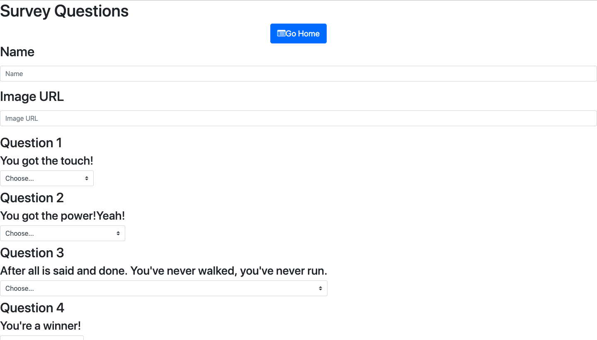
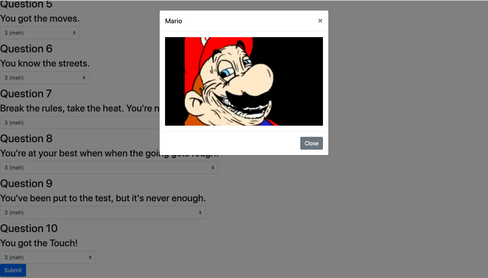

# Friend Finder
* Application
    - Finds your best friend in the whole wide world!
    - Enter info in the survey
        - Name
        - Image link
        - Answer some tough questions
    -  Have fun!

* Technology used
    - JS
    - HTML
    - Node.js
    - Express
    - Path

* Process
    - Identify the objective
    - Find the tools and methods necessary to fulfill the objective
    - Organize files 
    - Link files and paths
    - Order in a manner which makes sense
    - Test for problems
        - Log areas to look for bugs
        - Makes sure paths and links are correct
    - Write out a solid README.md

### Link to Deployed Page

https://strawberry-cupcake-21471.herokuapp.com/

### IMAGE of Final Product

### Learning Points
* A solid plan via pseudocoding saves time and energy
* When working with servers placement is key to ensure everything transpires in order
* Establishing a clean and organized javascript 
    - Makes the entire process easier to understand
    - Helps with debugging
* When dealing with multiple files making sure links, paths, and varibles correct in all areas
* Solid Google-Fu is indispensable

### Author

## Cyrus Ghadiri

### Acknowledgments

* UC BERKELEY BOOTCAMP TEAM
* https://www.npmjs.com
    - Path
    - Express